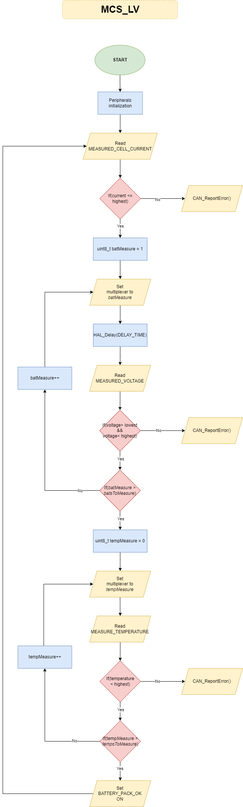

# MCS_lv

Addresses:

TxID: **0x003A**

RxID: **0x003F**

# Request

1. Battery pack voltage [%]:

| RxID | 2   | 0x3D | 0x01  |
| ---- | --- | ---- | ----- |
|      | DLC | READ | RegID |

2. Battery_1, Battery_2 and Batter_3 voltage:

| RxID | 2   | 0x3D | 0x02  |
| ---- | --- | ---- | ----- |
|      | DLC | READ | RegID |

3. Battery_4, Battery_5 and Batter_6 voltage:

| RxID | 2   | 0x3D | 0x03  |
| ---- | --- | ---- | ----- |
|      | DLC | READ | RegID |

4. Measured current:

| RxID | 2   | 0x3D | 0x04  |
| ---- | --- | ---- | ----- |
|      | DLC | READ | RegID |

5. Temperature measure from cells 1-3:

| RxID | 2   | 0x3D | 0x05  |
| ---- | --- | ---- | ----- |
|      | DLC | READ | RegID |

6. Temperature measure from cells 4-6:

| RxID | 2   | 0x3D | 0x06  |
| ---- | --- | ---- | ----- |
|      | DLC | READ | RegID |

7. Temperature measure from cells 7-9:

| RxID | 2   | 0x3D | 0x07  |
| ---- | --- | ---- | ----- |
|      | DLC | READ | RegID |

8. Temperature measure from cells 10-12:

| RxID | 2   | 0x3D | 0x08  |
| ---- | --- | ---- | ----- |
|      | DLC | READ | RegID |

9. Temperature measure from cells 13-15:

| RxID | 2   | 0x3D | 0x09  |
| ---- | --- | ---- | ----- |
|      | DLC | READ | RegID |

10. Ambient temperature:

| RxID | 2   | 0x3D | 0x0A  |
| ---- | --- | ---- | ----- |
|      | DLC | READ | RegID |

11. Turn battery pack down:

| RxID                               | 3   |       | 0x0B  | 0xNN      | Range | Units |
| ---------------------------------- | --- | ----- | ----- | --------- | ----- | ----- |
|                                    | DLC | WRITE | RegID | data[0-7] | 8bit  | 0-1   |
| Battery pack status: (1-0N, 0-OFF) |     |       |       |           |       |       |

# Respond

1. Battery pack voltage [%]:

| TxID | 3   | 0x01  | 0xNN      | 0xNN       | Range | Units   |
| ---- | --- | ----- | --------- | ---------- | ----- | ------- |
|      | DLC | RegID | data[0-7] | data[8-15] | 16bit | 0-65535 |

2. Battery_1, Battery_2 and Battery_3 voltage:

| TxID | 7   | 0x02  | 0xNN       | 0xNN        | 0xNN       | 0xNN        | 0xNN       | 0xNN        | Range | Units   |
| ---- | --- | ----- | ---------- | ----------- | ---------- | ----------- | ---------- | ----------- | ----- | ------- |
|      | DLC | RegID | bat_1[0-7] | bat_1[8-15] | bat_2[0-7] | bat_2[8-15] | bat_3[0-7] | bat_3[8-15] | 16bit | 0-65535 |

3. Battery_4, Battery_5 and Battery_6 voltage:

| TxID | 7   | 0x03  | 0xNN       | 0xNN        | 0xNN       | 0xNN        | 0xNN       | 0xNN        | Range | Units   |
| ---- | --- | ----- | ---------- | ----------- | ---------- | ----------- | ---------- | ----------- | ----- | ------- |
|      | DLC | RegID | bat_4[0-7] | bat_4[8-15] | bat_5[0-7] | bat_5[8-15] | bat_6[0-7] | bat_6[8-15] | 16bit | 0-65535 |

4. Measured current:

| TxID | 3   | 0x04  | 0xNN         | 0xNN          | Range | Units   |
| ---- | --- | ----- | ------------ | ------------- | ----- | ------- |
|      | DLC | RegID | current[0-7] | current[8-15] | 16bit | 0-65535 |

5. Temperature measure from cells 1-3:

| TxID | 7   | 0x05  | 0xNN        | 0xNN         | 0xNN        | 0xNN         | 0xNN        | 0xNN         | Range | Units   |
| ---- | --- | ----- | ----------- | ------------ | ----------- | ------------ | ----------- | ------------ | ----- | ------- |
|      | DLC | RegID | temp_1[0-7] | temp_1[8-15] | temp_2[0-7] | temp_2[8-15] | temp_3[0-7] | temp_3[8-15] | 16bit | 0-65535 |

6. Temperature measure from cells 4-6:

| TxID | 7   | 0x06  | 0xNN        | 0xNN         | 0xNN        | 0xNN         | 0xNN        | 0xNN         | Range | Units   |
| ---- | --- | ----- | ----------- | ------------ | ----------- | ------------ | ----------- | ------------ | ----- | ------- |
|      | DLC | RegID | temp_4[0-7] | temp_4[8-15] | temp_5[0-7] | temp_5[8-15] | temp_6[0-7] | temp_6[8-15] | 16bit | 0-65535 |

7. Temperature measure from cells 7-9:

| TxID | 7   | 0x07  | 0xNN        | 0xNN         | 0xNN        | 0xNN         | 0xNN        | 0xNN         | Range | Units   |
| ---- | --- | ----- | ----------- | ------------ | ----------- | ------------ | ----------- | ------------ | ----- | ------- |
|      | DLC | RegID | temp_7[0-7] | temp_7[8-15] | temp_8[0-7] | temp_8[8-15] | temp_9[0-7] | temp_9[8-15] | 16bit | 0-65535 |

8. Temperature measure from cells 10-12:

| TxID | 7   | 0x08  | 0xNN         | 0xNN          | 0xNN         | 0xNN          | 0xNN         | 0xNN          | Range | Units   |
| ---- | --- | ----- | ------------ | ------------- | ------------ | ------------- | ------------ | ------------- | ----- | ------- |
|      | DLC | RegID | temp_10[0-7] | temp_10[8-15] | temp_11[0-7] | temp_11[8-15] | temp_12[0-7] | temp_12[8-15] | 16bit | 0-65535 |

9. Temperature measure from cells 13-15:

| TxID | 7   | 0x09  | 0xNN         | 0xNN          | 0xNN         | 0xNN          | 0xNN         | 0xNN          | Range | Units   |
| ---- | --- | ----- | ------------ | ------------- | ------------ | ------------- | ------------ | ------------- | ----- | ------- |
|      | DLC | RegID | temp_13[0-7] | temp_13[8-15] | temp_14[0-7] | temp_14[8-15] | temp_15[0-7] | temp_15[8-15] | 16bit | 0-65535 |

10. Ambient temperature:

| TxID | 7   | 0x0A  | 0xNN         | 0xNN          | Range | Units   |
| ---- | --- | ----- | ------------ | ------------- | ----- | ------- |
|      | DLC | RegID | ambient[0-7] | ambient[8-15] | 16bit | 0-65535 |

# Error list

1. Overvoltage

| TxID | 2   | 0x1D  | 0x01 |
| ---- | --- | ----- | ---- |
|      | DLC | ERROR | Code |

2. Undervoltage

| TxID | 2   | 0x1D  | 0x02 |
| ---- | --- | ----- | ---- |
|      | DLC | ERROR | Code |

3. Overcurrent

| TxID | 2   | 0x1D  | 0x03 |
| ---- | --- | ----- | ---- |
|      | DLC | ERROR | Code |

4. Overtemperature

| TxID | 2   | 0x1D  | 0x04 |
| ---- | --- | ----- | ---- |
|      | DLC | ERROR | Code |
